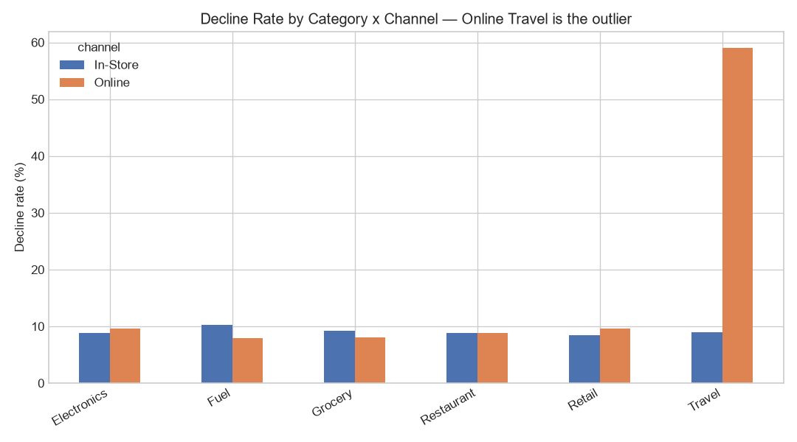

# Merchant Portfolio Performance Analysis - Python (pandas)

Analysis of a **50,000-transaction merchant portfolio** to measure performance and diagnose what was driving lost (declined) revenue. Built in Python with pandas and matplotlib.

## Business question
A merchant-acquiring portfolio was losing revenue to declined transactions. The top-line decline rate looked manageable at **11%**. The goal was to find out whether that number was hiding a concentrated, fixable problem.

## Approach
1. **Cleaned and verified the data** - removed duplicate transactions, standardised inconsistent category labels, and handled missing region values before trusting any number.
2. **Measured portfolio KPIs** - approved revenue, overall decline rate, and the total value of declined transactions.
3. **Investigated the decline rate** -broke it down by channel (only mildly elevated) and by category (which flagged Travel), then crossed the two in a **category × channel** view to localise the problem  which revealed it was confined to a single channel within that category.

## Key finding
The 11% headline decline rate was masking a single failing segment:

| Segment | Decline rate | vs. rest of portfolio |
|---|---|---|
| **Online Travel** | **59%** | **~6.6× higher** |
| Everything else | ~9% | baseline |

Looking at category alone flagged Travel as elevated, but couldn't explain why. The category × channel breakdown showed the split: **In-Store Travel declined at a normal 9%, while Online Travel declined at 59%** - every other category/channel combination sat in a normal 8–10% band. Because the problem was isolated to one channel (not Travel as a whole), it points to a **mis-set risk/decline rule on that segment** rather than Travel being inherently risky, genuine fraud, or customer behaviour.



## Impact
If Online Travel declined at the portfolio baseline instead of 59%, an estimated **~$9.6M in transaction value** would have been recoverable (an approximation based on the segment's average declined transaction value). Recommendation: review the risk rule applied to that segment before treating the decline rate as a customer or fraud problem.

## What this demonstrates
- Not trusting a top-line metric - drilling into interactions to find where a number comes from.
- Cleaning and validating source data before analysis.
- Translating a data finding into a business recommendation with a quantified $ impact.

## Files
- `generate_data.py` - creates the synthetic transaction dataset
- `analysis.py` - cleaning, KPIs, decline-rate investigation, charts
- `merchant_portfolio_analysis.ipynb` - the same analysis as an interactive notebook
- `merchant_transactions.csv` - the dataset (regenerated by `generate_data.py`)
- `chart_decline_by_segment.png` - the key finding
- `chart_revenue_by_category.png`, `chart_monthly_trend.png` - portfolio context

## Run it
```bash
pip install -r requirements.txt
python generate_data.py
python analysis.py
```

## Note on the data
The dataset is **synthetic**. I generated it with `generate_data.py` (with a realistic decline problem built in) so I could practise the full decline-analysis workflow end to end in Python. The analytical method is the point; the data is not real company data.
